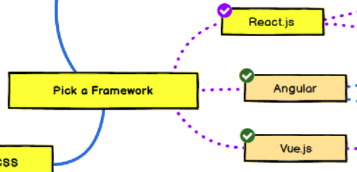
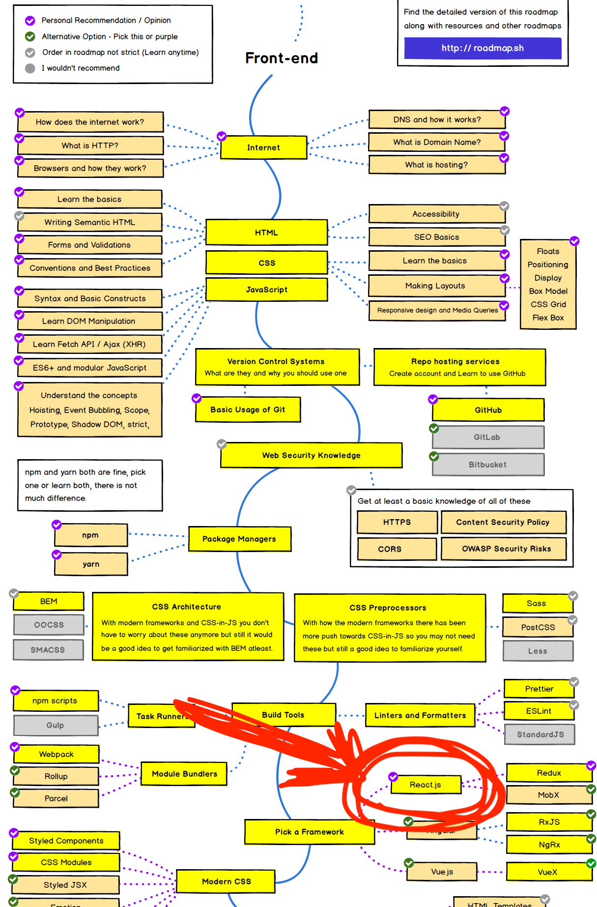
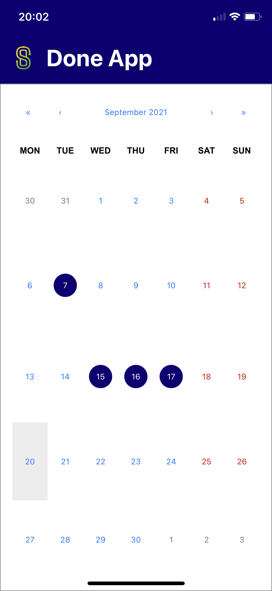
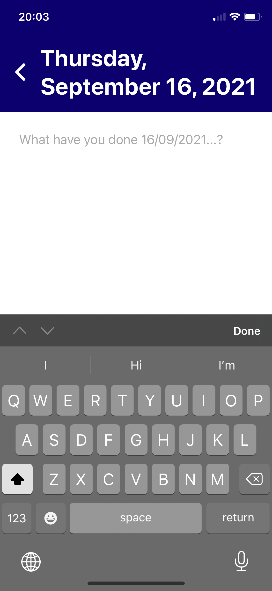

# React For Beginners

## SABO Academy 2021

### Nikita Evstigneev

---

# Topics

- What React brings and how it works
- Basic features of React
- Setting up environment
- Developing first React app
- Deploying the result

---

# Organization

- Two parts
  1. Not so boring theory (let's hope!)
  2. Coding our first app & deploying
- Ask questions anytime
- Supporting materials available at https://hackmd.io/@evstinik/react4beginners
  

---

# Motivation to learn React

---

# Motivation to learn React

- Big community
- Perfect fit for quick hacking / prototyping
- Declarative paradigm

---

# Before we start...



---

# Frontend path starts elsewhere...

- Source: https://roadmap.sh/frontend



---

# Let's get on the same level

- React ecosystem is huge
- It's easy to get lost
- Important to distinguish what is React and what is not

---

# Basic web app architecture


- Client & server
- Server provides data & **static files of frontend**
- Client is a browser in our case
- All frontend code is run in browser

---

# What offers browser

- HTML, CSS & JavaScript support
- Document Object Model (DOM)
- Manipulation with DOM elements
  - createElement, innerHTML, appendChild, getElementById, ...
- Events 
  - onclick, onhover, ondrop, ...

--- 

# Example

```html
<body>
  <div id="root"></div>

  <script type="text/javascript">
    const rootElement = document.getElementById('root')
    const element = document.createElement('div')
    element.textContent = 'Hello World'
    element.className = 'container'
    rootElement.appendChild(element)
  </script>
</body>
```

---

# Motivation (of Facebook) to introduce React

- Mutations are complicated
  - would be nice to just throw away existing view and render it from scratch
- Reusable drop-in pieces (comments block, for example)
- Achieved with so called Configurable Components

---

# React

- JavaScript library for building user interfaces
- Declarative paradigm
- One way data binding
- Components & JSX

---

# Same example in React

```javascript
<body>
  <div id="root"></div>

  <script type="text/javascript">
    const rootElement = document.getElementById('root')
    const element = React.createElement('div', {
      className: 'container',
      children: 'Hello World',
    })
    ReactDOM.render(element, rootElement)
  </script>
</body>
```

---

# Same example in React with JSX

```jsx
<body>
  <div id="root"></div>

  <script type="text/javascript">
    const rootElement = document.getElementById('root')
    const element = (
      <div className='container'>
        Hello World
      </div>
    )
    ReactDOM.render(element, rootElement)
  </script>
</body>
```

---

# JSX interpolation

```jsx
const rootElement = document.getElementById('root')
const className = 'container'
const children = 'Hello World'
const element = (
  <div className={className}>
    {children.toUpperCase()}
  </div>
)
ReactDOM.render(element, rootElement)
```

---

# Babel

- JavaScript compiler
- Newer or not standard syntax to older
- Usage
  - via bundler
  - attach to the page via <script>
- https://babeljs.io/repl

---

# React components

- Class components
```javascript
class ActionButton extends React.Component {
  render() { ... }
}
```
- Function components
```javascript
function ActionButton() {
  ...
}
```

---

# React component usage example

```jsx
function doAction() { ... }

...

<ActionButton title='Click Me' onAction={doAction} />
```

---

# React component definition example

```jsx
function ActionButton(props) {
  return (
    <button onClick={props.doAction}>
      {props.title}
    </button>
  )
}
```

---

# React component definition example

```jsx
function ActionButton(props) {
  const { doAction, title } = props
  return (
    <button onClick={doAction}>
      {title}
    </button>
  )
}
```

---

# Composing UI from components

```jsx
function Counter() {
  return (
    <div>
      Counter: 0
      <ActionButton title='+1' onAction={...} />
      <ActionButton title='-1' onAction={...} />
    </div>
  )
}
```

---

# What about state?

```jsx
function Counter() {
  let counter = 0
  
  function inc() {
    counter += 1
  }
  
  function dec() {
    counter -= 1
  }
  
  return (
    <div>
      Counter: {counter}
      <ActionButton title='+1' onAction={inc} />
      <ActionButton title='-1' onAction={dec} />
    </div>
  )
}
```

---

# React insights

- Internal representation
  - tree of React elements (virtual DOM)
- First render (`ReactDOM.render`)
  1. virtual DOM -> string
  2. `rootElement.innerHTML = <result>`
  3. attaching event listeners
- Next render
  - generating new virtual DOM
  - comparing with previous
  - calculating & executing minimal set of DOM operations to achieve new state

---

# When new render happens?

- Globally
  - Manual call to `ReactDOM.render`
  - Changing component state
- Component-limited
  - Received new props from parent component
  - Changing component state

---

# Introducing state

```jsx
function MySuperComponent() {
  const myState = React.useState(defaultValue)
  const myStateValue = myState[0]
  const myStateSetter = myState[1]
  ...
  console.log(myStateValue)
  myStateSetter(someNewValue)
  ...
}
```

---

# Introducing state

```jsx
function MySuperComponent() {
  const [myState, setMyState] = React.useState(defaultValue)
  ...
  console.log(myState)
  setMyState(someNewValue)
  ...
}
```

---

# React.useState hook

- `React.useState` returns a tuple - value and setter
- After calling setter (if any change happend) React marks component as "dirty" and will rerender it
- Setter may be asyncronous!
- Values are compared via shallow comparison
  - Primitive types by value (string, number, boolean, undefined, null)
  - Others by reference
  - Examples
    - "Nikita" == "Nikita"
    - 26 == 26
    - { name: "Nikita", age: 26 } != { name: "Nikita", age: 26 }

---

# React.useState hook

- To change value setter must be used

```javascript
const [counter, setCounter] = React.useState(0)
counter += 1 // not OK
setCounter(counter + 1) // OK
```

```javascript
const [person, setPerson] = React.useState({
  name: 'Nikita',
  age: 26
})
person.age += 1 // not OK
setPerson(person) // not OK
// OK:
setPerson({
  ...person,
  age: person.age + 1
})
```

---

# Counter with useState

```jsx
function Counter() {
  const [counter, setCounter] = React.useState(0)
  
  function inc() {
    setCounter(counter + 1)
  }
  
  function dec() {
    setCounter(counter - 1)
  }
  
  return (
    <div>
      Counter: {counter}
      <ActionButton title='+1' onAction={inc} />
      <ActionButton title='-1' onAction={dec} />
    </div>
  )
}
```

---

# Questions

---

# Let's code!

---

# Prerequisites

- Node.js (v14)
- Chrome, React Dev Tools
- VS Code (or any other IDE)

---

# Done App

- Note taking app
- Take a note what you have done on certain day

---

# Done App - Day picker

- Pick a day
- Indicate days that have a note



---

# Done App - Write a note

- Write a note



---

# Coding session

---

# Thank you!